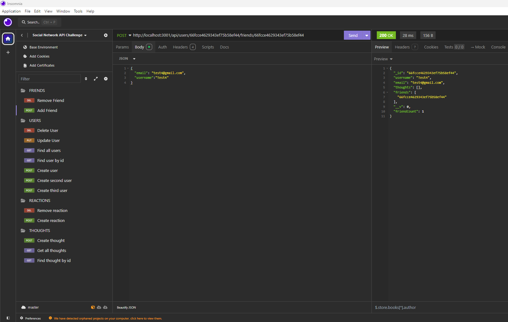

# Social Network API

## Description

This project is a Social Network API that allows users to create and manage their social interactions. It provides functionality for user management, thought management, and reactions to thoughts, using Mongoose to interact with a MongoDB database.

## Table of Contents

- [Description](#description)
- [Installation](#installation)
- [Usage](#usage)
- [API Routes](#api-routes)
- [Models](#models)
- [Contributing](#contributing)
- [Screenshots](#screenshots)
- [Walkthrough Video](#walkthrough-video)
- [License](#license)

## Installation

1. Clone the repository:
2. Navigate to the project directory 
3. Install the necessary dependencies: npm install
4. Start the server: npm start

- The server will start on http://localhost:3001.

## Usage
- Start the server with command- npm start
- This will start the server and sync the Mongoose models to the MongoDB database.
- Use Insomnia or any API testing tool to interact with the API.

## API Routes

1. Friends

- POST /api/users/friends/: Add a friend to a user's friend list.
- DELETE /api/users/friends/: Remove a friend from a user's friend list.

2. Users

- GET /api/users: Retrieve all users.
- GET /api/users/: Retrieve a user by ID.
- POST /api/users: Create a new user.
- PUT /api/users/: Update a user by ID.
- DELETE /api/users/: Delete a user by ID.

3. Reactions

- POST /api/thoughts/reactions: Add a reaction to a thought.
- DELETE /api/thoughts/reactions/: Remove a reaction from a thought.

4. Thoughts

- GET /api/thoughts: Retrieve all thoughts.
- GET /api/thoughts/: Retrieve a thought by ID.
- POST /api/thoughts: Create a new thought.
- PUT /api/thoughts/: Update a thought by ID.
- DELETE /api/thoughts/: Delete a thought by ID.

## Models

1. **User** - Represents users of the social network. Each user has a username, email, and a list of friends. Users can also have thoughts associated with them.
   - Fields:
     - `username`: A string that must be unique and is required.
     - `email`: A unique and required string that is validated using a regular expression.
     - `thoughts`: An array of `ObjectId` references to the Thought model, representing the thoughts created by the user.
     - `friends`: An array of `ObjectId` references to other User models, representing the user's friend list.
   - Virtuals:
     - `friendCount`: Returns the number of friends a user has.

2. **Thought** - Represents thoughts or posts created by users. Each thought has a content field and reactions associated with it.
   - Fields:
     - `thoughtText`: A required string representing the content of the thought. The length must be between 1 and 280 characters.
     - `createdAt`: A timestamp representing when the thought was created, automatically set to the current date and time.
     - `username`: A reference to the username of the user who created the thought.
     - `reactions`: An array of reaction subdocuments associated with the thought.
   - Virtuals:
     - `reactionCount`: Returns the number of reactions a thought has received.

3. **Reaction** - A subdocument schema used within the Thought model. Represents reactions or comments on thoughts. This model is not a standalone schema but exists as a nested schema within the Thought model.
   - Fields:
     - `reactionId`: A unique identifier for each reaction.
     - `reactionBody`: A required string that represents the content of the reaction.
     - `username`: A string that represents the user who reacted.
     - `createdAt`: A timestamp representing when the reaction was created.

4. **Friend** - This is handled as a self-referencing relationship on the User model. Users can add other users as friends. The User model contains an array of `ObjectId` references to other users, representing their friends.
   - Fields:
     - `friendId`: An `ObjectId` representing another user who is a friend.

## Contributing
1. Fork the repository.
2. Create a new branch (`git checkout -b feature-branch`).
3. Commit your changes (`git commit -m "Add new feature"`).
4. Push to the branch (`git push origin feature-branch`).
5. Open a pull request.

## Screenshots

## Walkthrough Video 

## License
This project is licensed under the [MIT LICENSE](LICENSE).

> [!NOTE]  
> Recourses used for creating code. Referred back to class work for file format such as reviewing class recording. Worked with peers on assignment and compared challenge template to 
assist with creating readme file.
